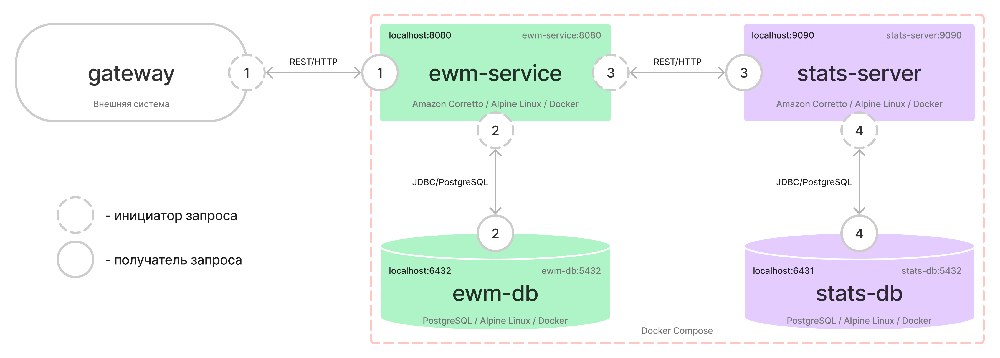
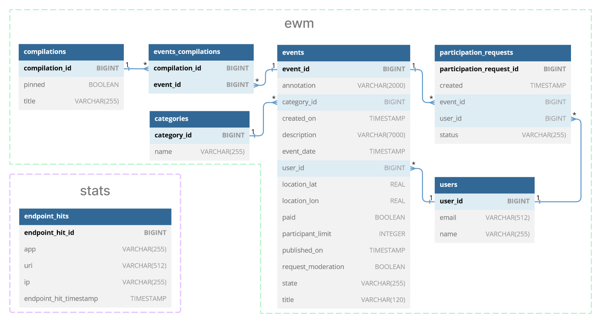

# java-explore-with-me

Ссылка на pull-request:

https://github.com/aigeley/java-explore-with-me/pull/4

Модель компонентов:



ER-диаграмма:



Запуск приложения:

```shell
docker-compose up
```

Swagger UI для тестирования доступен по ссылкам:

- ewm-service: http://localhost:8080
- stats-server: http://localhost:9090

Postman-тесты в файле `/postman/feature.json`

При изменении кода сущностей `@Entity`, перезапустить кодогенерацию классов QueryDSL командой `mvn clean compile`.
Сгенерированные классы скопировать из папки `/target/generated-sources/java`
в папку `/repository/util` для каждого модуля.

Для запуска кодогенерации по спецификациям OpenAPI,
в `pom.xml` выставить значение параметра `<skip>false</skip>` для плагина `openapi-generator-maven-plugin`.

Для проверки покрытия на локальной машине,
в `pom.xml` добавить `<phase>test</phase>` к цели `<id>jacoco-check</id>` и запустить `mvn test`:

```xml

<plugin>
    <groupId>org.jacoco</groupId>
    <artifactId>jacoco-maven-plugin</artifactId>
    ...
    <executions>
        ...
        <execution>
            <id>jacoco-check</id>
            <phase>test</phase>
            <goals>
                <goal>check</goal>
            </goals>
            <configuration>
                ...
```

Для проверки Postman-тестов на локальной машине,
в `docker-compose.yml` добавить `TZ=Europe/Moscow` в массив `environment` для каждого из `services`:

```yaml
services:
  ...
  environment:
    ...
    - TZ=Europe/Moscow
```

Пересоздание БД:

```postgresql
--Создание пользователя
DROP USER IF EXISTS test;
CREATE USER test WITH SUPERUSER PASSWORD 'test';

--Пересоздание БД
--ewm-db
DROP DATABASE IF EXISTS ewm;
CREATE DATABASE ewm WITH OWNER test;
--stats-db
DROP DATABASE IF EXISTS stats;
CREATE DATABASE stats WITH OWNER test;

--Удаление таблиц и сиквенсов
--ewm-db
DROP TABLE IF EXISTS marks;
DROP SEQUENCE IF EXISTS mark_seq;
DROP TABLE IF EXISTS events_compilations;
DROP TABLE IF EXISTS compilations;
DROP SEQUENCE IF EXISTS compilation_seq;
DROP TABLE IF EXISTS participation_requests;
DROP SEQUENCE IF EXISTS participation_request_seq;
DROP TABLE IF EXISTS events;
DROP SEQUENCE IF EXISTS event_seq;
DROP TABLE IF EXISTS users;
DROP SEQUENCE IF EXISTS user_seq;
DROP TABLE IF EXISTS categories;
DROP SEQUENCE IF EXISTS category_seq;
--stats-db
DROP TABLE IF EXISTS endpoint_hits;
DROP SEQUENCE IF EXISTS endpoint_hit_seq;
```